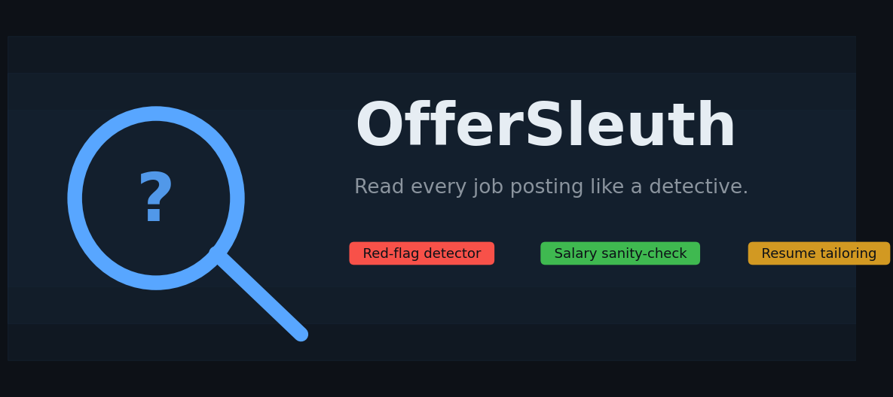
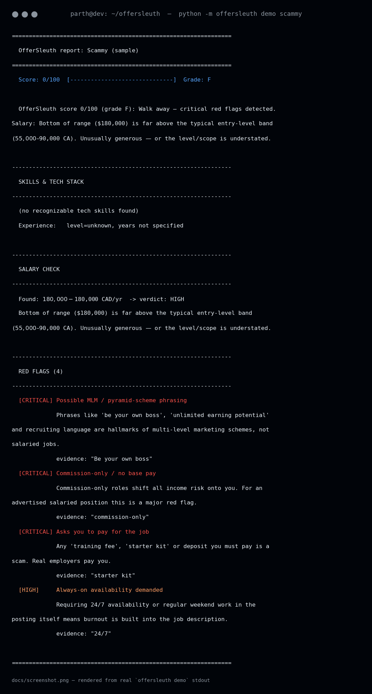
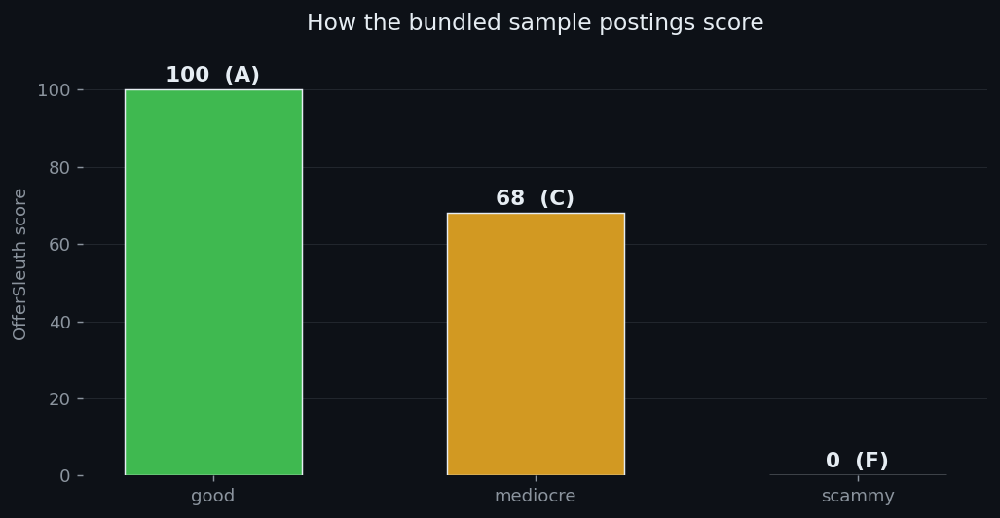

# OfferSleuth 🔍

**Paste in a job posting. Get a detective's report: red flags, salary reality-check, and which resume bullets to lead with.**


Job hunting is asymmetric: employers read your resume in six seconds, while you're expected to decode *their* posting with zero tooling. OfferSleuth flips that. Point it at any job description and it scores the posting, calls out the sketchy parts (MLM phrasing, "we're a family", commission-only traps, missing salary), checks the pay against real entry-level bands for Canada and the US, and tells you exactly which of your resume bullets to emphasize — and which keywords you're missing.

No API keys. No network. No accounts. Just Python.

## ✨ Features

- **🔴 Red-flag detector** — 15+ rules across 5 severity levels: hero-culture language ("rockstar/ninja"), crunch euphemisms ("fast-paced environment"), MLM/pyramid phrasing, commission-only roles, unpaid trial work, pay-to-work scams, always-on availability demands, excessive requirements for the level, laundry-list tech stacks, and more. Every flag ships with an explanation and the exact quote that triggered it.
- **💰 Salary sanity-check** — parses `$65k–$80k`, `$35/hr`, `$5,000/month` and compares against built-in entry→senior bands for CA/US (tune them in `demo_data/salary_ranges.json`). Flags missing pay, underpaid offers, and suspiciously inflated ones.
- **🛠 Skill extraction** — required vs. nice-to-have skills, tech-stack mentions with categories, and years-of-experience signals, all section-aware (it knows "Nice to have" isn't "Required").
- **📝 Resume tailoring** — feed it your bullets; it ranks which to lead with for *this* posting and lists the keyword gaps to close.
- **📊 0–100 posting score** with a letter grade, so you can triage a dozen postings in minutes.
- **Dual interface** — a polished CLI *and* an importable library (`import offersleuth`).

## 📸 In action

Real output from `python -m offersleuth demo scammy` (rendered from actual stdout):



The three bundled sample postings score exactly how you'd hope:



## 🚀 Quickstart

```bash
# 1. Clone and enter
git clone https://github.com/872000/offersleuth.git
cd offersleuth

# 2. Run the test suite (41 tests, stdlib only)
python3 -m pytest -q

# 3. Run the end-to-end demo on all three bundled sample postings
python3 -m offersleuth demo

# 4. Analyze a single posting file
python3 -m offersleuth demo_data/sample_jds/good.md

# 5. Paste a JD directly, or pipe one in
python3 -m offersleuth --jd "Junior Java developer. Spring Boot required. Salary $70,000. We're a family!"
cat posting.txt | python3 -m offersleuth --stdin

# 6. Bring your own resume bullets (one per line)
python3 -m offersleuth posting.txt --resume my_resume.txt

# 7. Machine-readable output for scripting
python3 -m offersleuth demo_data/sample_jds/mediocre.md --json | python3 -m json.tool
```

Requires Python 3.10+. The only optional dependency is `matplotlib` (used solely by `tools/make_images.py` to regenerate the docs images) — the analyzer itself is pure stdlib.

## 🧰 Tech stack

| Layer | Choice |
|---|---|
| Language | Python 3.10+ |
| Dependencies | **None** — stdlib only (`re`, `argparse`, `json`, `dataclasses`) |
| Detection | Hand-tuned regex rule engine (transparent, no black box) |
| Testing | `pytest`, 41 tests |
| Docs images | `matplotlib` (dev-only, for `tools/make_images.py`) |

## 📁 Project structure

```
offersleuth/
├── offersleuth/            # the library + CLI
│   ├── __init__.py         # public API: analyze(), detect_red_flags(), ...
│   ├── cli.py              # argparse CLI (demo / analyze subcommands)
│   ├── report.py           # pipeline orchestration, scoring, grading
│   ├── extractor.py        # skill / tech-stack / experience extraction
│   ├── redflags.py         # 15+ red-flag rules with severity + explanation
│   ├── salary.py           # salary parsing + market-band sanity check
│   ├── resume.py           # resume-bullet tailoring
│   └── render.py           # terminal + JSON report rendering
├── demo_data/
│   ├── sample_jds/         # good.md / mediocre.md / scammy.md
│   ├── sample_resume.txt   # bundled sample resume bullets
│   └── salary_ranges.json  # configurable CA/US pay bands
├── tests/                  # pytest suite (41 tests)
├── tools/make_images.py    # regenerates docs/hero.png, screenshot.png, scores.png
├── docs/                   # hero.png, screenshot.png, scores.png
├── README.md
├── LICENSE
└── pyproject.toml
```

## 🐍 Library usage

```python
import offersleuth

report = offersleuth.analyze(
    open("posting.txt").read(),
    title="Junior Backend Dev @ Acme",
    resume_bullets=open("resume.txt").read().splitlines(),
)

print(report.score, report.grade)          # 68 C
print(report.summary)                      # one-paragraph verdict
for flag in report.red_flags:              # severity, title, explanation, evidence
    print(flag.severity, flag.title)
print(report.salary.verdict, report.salary.detail)
for gap in report.skill_gaps:              # skill, category, covered?
    print(gap.skill, "covered!" if gap.covered else "MISSING")
```

Swap in your own pay bands any time:

```python
ranges = offersleuth.load_ranges("my_bands.json")
report = offersleuth.analyze(jd_text, ranges=ranges)
```

## 🗺 Roadmap

- [ ] PDF/DOCX resume ingestion (extract bullets automatically)
- [ ] More locales for salary bands (UK, EU, India)
- [ ] Confidence-weighted fuzzy skill matching ("k8s" ⇄ "Kubernetes" everywhere)
- [ ] HTML report export for sharing
- [ ] Browser extension: one-click analysis on LinkedIn/Indeed posting pages
- [ ] Optional LLM pass for plain-English negotiation talking points (still offline-first)

## 📄 License

MIT — see [LICENSE](LICENSE). Built by [Parth (872000)](https://github.com/872000).
